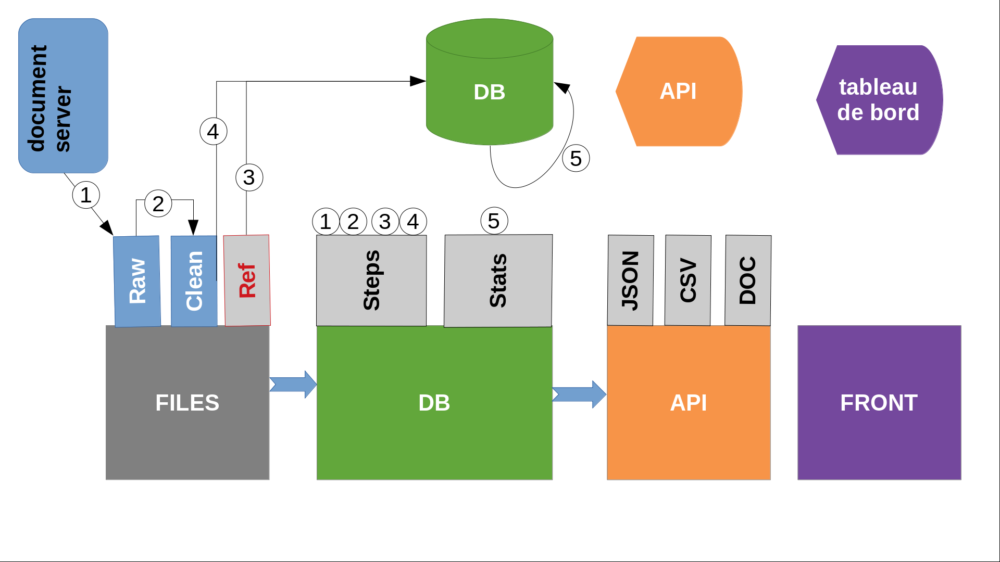

# ABOUT Kalulu APP

This project has been developped by [DRISS](https://driss.org) team:
- Constance de Quatrebarbes (LeadDev)
- Célya Gruson Daniel(PM)
- Tristan Ibanez (FrontDev)

designed by Cassandra Potier Watkins and deployed by Isabelle Denghien


Kalulu app consists of 4 main functionnal **modules** into a python package

- [files](contribution-guide/files.md)
- [db](contribution-guide/db.md)
- [api](contribution-guide/api.md)
- [front](contribution-guide/front.md)




Files, db, api are written in Python3.7
Database is a MongoDb 4.2
Front is in Vue.js 2
Supported OS is Debian 9


## Files

Stores the  references files and the raw files to populate the database

```
├── archived
├── clean
├── dump
├── raw
└── references
```
> see [files](contribution-guide/files.md) for a complete description of the files

## DB

DB consists of a python package with all the python scripts to init, populate and update records of the database (MongoDB): 

```
├── __init__.py
├── run.py
├── stats
│   ├── chapter.py
│   ├── classroom.py
│   ├── confusion.py
│   ├── dataset.py
│   ├── day.py
│   ├── decision.py
│   ├── digits.py
│   ├── words.py
│   ├── lesson.py
│   ├── tag.py
│   ├── student.py
│   ├── subject.py
│   ├── syllabs.py
│   ├── main.py
│   └── __init__.py
└── steps
    ├── clean.py
    ├── download.py
    ├── init.py
    ├── insert.py
    ├── main.py
    └── __init__.py
    
```

- `run.py` shell script to administrate the database in command line 
- `steps` module for data acquisition from raw to database 
- `stats` module for data analysis creating the statistical tables exposed in API and served in front

> see [db](./contribution-guide/db.md) for a complete description of the db module

> see [stats](./contribution-guide/stats.md) for a complete description of the stats submodule

> see [tables](./contribution-guide/tables.md) for a complete description of the tables


## API

The interface API to consult and modify the database

written in  python Flask microframework 

with Swagger

```
.
├── API.py
├── celery_tasks
│   ├── app_task.py
│   ├── __init__.py
│   └── __pycache__
├── celery_workers.py
├── csv_blueprints
│   ├── activity.py
│   ├── admin.py
│   ├── index.py
│   ├── __init__.py
│   ├── progression.py
│   ├── skills.py
│   └── tasks.py
├── factory.py
├── namespaces
│   ├── activity.py
│   ├── admin.py
│   ├── classrooms.py
│   ├── __init__.py
│   ├── progression.py
│   ├── skills.py
│   ├── status.py
│   ├── students.py
│   └── tasks.py
└── __init__.py

```

API is the main access point to the API that consists in 2 main submodules:
- namespaces : JSON access and Swagger Interface
- csv_bvlueprint: CSV facilities with Flask

API website is exposed throught NGINX configuration file, using gunicorn and supervisord for handling process (API + celery).

> see [api](./contribution-guide/api.md) for a complete description of the api module

> see [api_manual.md](./researcher-guide/getting-started.md) for tutorial on using the API interface

## FRONT

The website for teacher and researcher in VUE.js (node)

```
├── build.js
├── node_modules
├── dist
├── package.json
├── src
│   ├── App.vue
│   ├── assets
│   ├── components
│   |    ├──    
│   ├── main.js
│   ├── routes.js
│   └── services.js
├── vue.config.js
└── webpack.config.js
```

FRONT website is exposed via NGINX

> see [front](./contribution-guide/front.md) for a complete description of the front module

> see [Tutorial](./user-guide/getting-started.md) for a step by step presentation of the dashboard for user