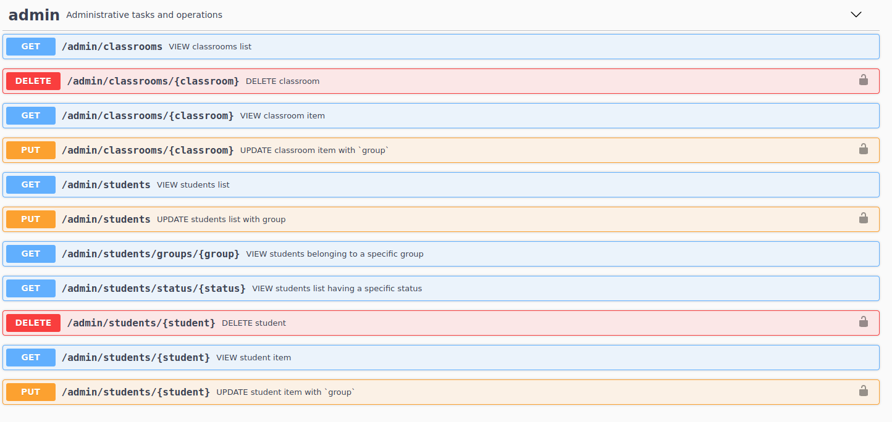
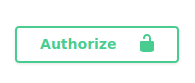
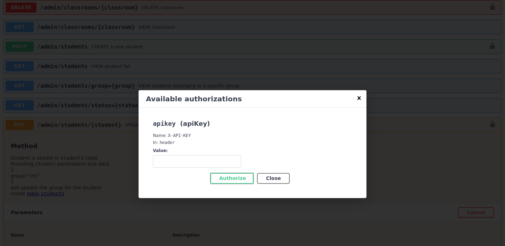
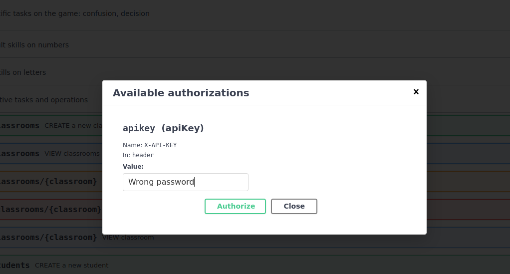
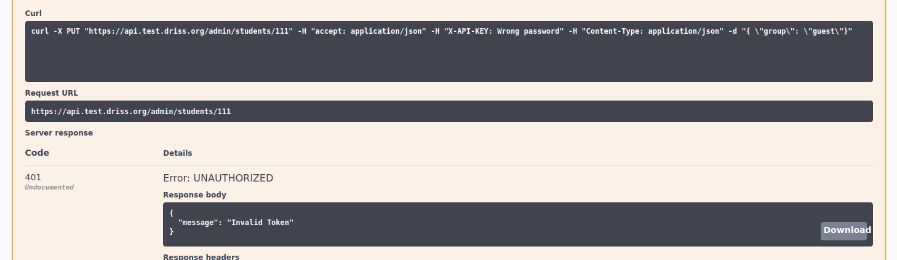
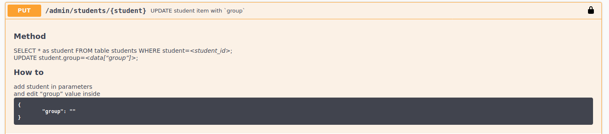
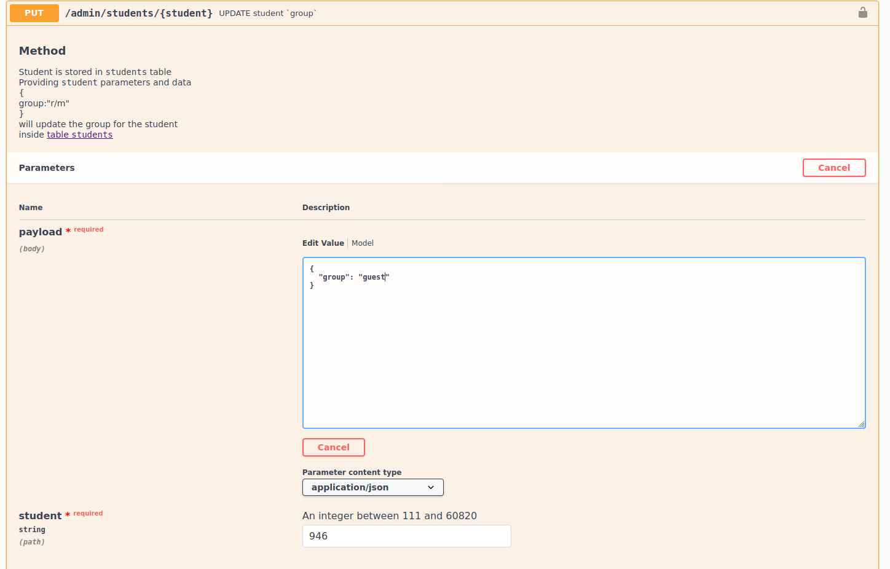
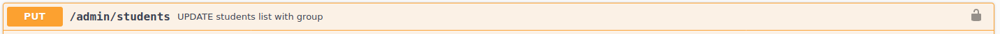
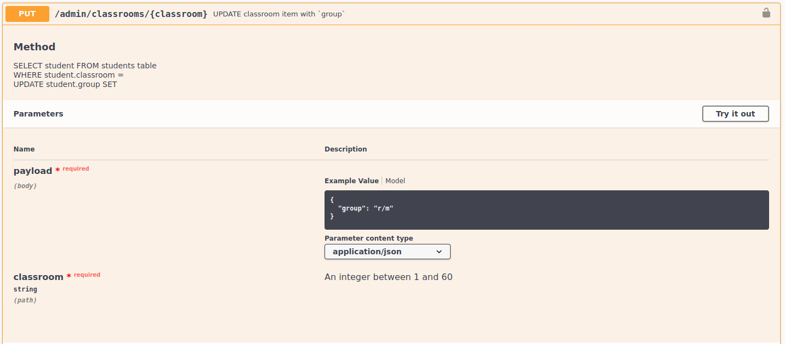
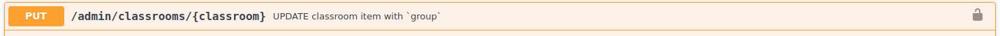

# API Advanced use

- [Access data with a programming language]()
- [ How to update data ?]()
    - Unlock access
    - Consult group of students
    - Edit group for one student
    - Edit group for multiple students
    - Edit group for classroom


### Access data with external script

You can access programmatically to the data in CSV
and load it. 


###### With python

```python
import requests
import pandas
API_URL = "https://www.api.test.driss.org"
#parameters
students = [1223, 1212, 1245] 
subjects = ["letters", "numbers"]
for students in students:
    for subject in subjects:
        endpoint = "/activity/students/{}/subjects/{}/csv".format(student,subject)
        r = requests.get(API_URL+endpoint)
        if r.code == 200:
            data = r.text
            csv_data = [x.split(',') for x in data.split('\n')]
            head = csv_data[0]
            df = pd.DataFrame(csv_data[1:], columns=head)
            print(df)
```
###### With R

An example in R:
```R

library (RCurl)
API_URL <- "https://www.api.test.driss.org"
students <- list(1223, 1212, 1245) 
subjects <- list("letters", "numbers")
for(students in students){
    for(subject in subjects){
        endpoint <- str_c(API_URL, "/activity/students/", student, "/subjects/", subject, "/csv")
        html_page <- getURL(endpoint)
    }
}

```

### How to update data ?

API provides access points and methods to consult, edit, update, delete specific resources. All theses methods stands in the endpoint category `admin`. Edition, suppression require both an authorisation set throught password to unlock the endpoint access.

The main usage here is to provide facilities to update the stats choosing to integrate or not specific students into the scope of the enquiry. 


Main operations:
* Unlock access
* Consult status of the students
* Change group for multiples students
* Change group for one classroom
* Change group for one student

#### Unlock access

Some endpoints requires an authorisation as they modify the database and impact the dashboard. 

In these case a lock appears on the left side of the endpoint.



You can unlock it click on the corresponding icon 

You can also unlock using the main button `Authorize` at the top right corner of the interface. 




This authorisation will lasts the time of a session: you don't need to enter the password each time you need to use a locked endpoint. 

1. Click on `Authorize` button on the top right corner of the interface.
2. Fill in the form with the password given
3. Click on the `Authorize` button 
4. Click on `Close` button (Logout is to revoke the access)





* If password is wrong: the request will return a 401 Error UNAUTHORIZED and a message will be displayed {"message": "Token is invalid"}







#### Consult group of students

* Consult students where group information is None

If group is None: group is missing for the student. It simply means that student was not referenced inside the initial csv listing students with they groups: 

in JSON : [https://api.test.driss.org/admin/students/groups/None](https://api.test.driss.org/admin/students/groups/None/csv)

in CSV : [https://api.test.driss.org/admin/students/groups/None/csv](https://api.test.driss.org/admin/students/groups/None/csv)


* Consult students which status is False


in JSON : [https://api.test.driss.org/admin/students/status/False](https://api.test.driss.org/admin/students/groups/None/csv)

in CSV : [https://api.test.driss.org/admin/students/status/False/csv](https://api.test.driss.org/admin/students/groups/None/csv)

Status of the student can be False for two reasons:
- group information is missing for this student (No reference of this student has been found in the initial file that define a group for each student)
- student was declared inside the initial file defining the group for each student but no files has been found.


To cover those 2 different cases a specific status is available

- status `missing` means that student was not initially declared but documents have been found so student exists in db but has no group

in JSON : [https://api.test.driss.org/admin/students/status/missing](https://api.test.driss.org/admin/students/groups/missing/csv)

in CSV : [https://api.test.driss.org/admin/students/status/missing/csv](https://api.test.driss.org/admin/students/groups/missing/csv)

- status `empty` means that student was initially declared but no documents have been found. student has only information given by the initial file

in JSON : [https://api.test.driss.org/admin/students/status/empty](https://api.test.driss.org/admin/students/groups/empty/csv)

in CSV : [https://api.test.driss.org/admin/students/status/empty/csv](https://api.test.driss.org/admin/students/groups/empty/csv)


#### Edit group for one student

You may want to edit a group for a specific student to declare the session he belongs to or to remove him from global stats (this is made by setting the group to `guest`): you will need to use the interface. 

Inside admin category endpoint a specific endpoint in orange  is available to edit a unique student.

PUT `/admin/students/{student}/`



* Press `try it out` button and the edit frorm will be shown.

* Fill in the form as following:
    * In parameters enter the student ID e.g 111
    * In payload change the value between  quotes attached to group e.g "guest"




* Press execute:
    > This request will update the group for the given student
    * If everything is OK: API will answer 200 response
    * In case of error: API will display 404, 406 errors and additional information will be displayed in response body 

> When group is changed from guest to ["r/m", "m/r"] this impact the stats: so a background function is fired to add the student to the stats tables and compute again the global tables. This operation takes about 3 minutes to proceed. Be patient! 

> When group is changed from ["r/m", "m/r"] to guest this impact the stats: so a background function is fired to remove the student from the stats tables and compute again the global tables. This operation takes about 3 minutes to proceed. Be patient!


#### Edit group for muliples student

You may want to edit a group for multiple students that doesn't necessarily belong to same classroom
to declare the session he belongs to or to remove him from global stats (this is made by setting the group to `guest`): you will need to use the interface. 

Inside admin category endpoint a specific endpoint in orange  is available to edit a multiple student.

PUT `/admin/students/`



* Press `try it out` button and the edit frorm will be shown.


* Fill in the form as following:
    * In payload change the value between  quotes attached to group e.g "guest"
    * In payload change the value between  quotes attached to students e.g "112, 113, 2987"


* Press execute:
    
    > This request will update the group for all the students in the list
    * If everything is OK: API will answer 200 response
    * In case of error: API will display 404, 406 errors and additional information will be displayed in response body 

> When group is changed from guest to ["r/m", "m/r"] this impact the stats: so a background function is fired to add the student to the stats tables and compute again the global tables. This operation takes about 3 minutes to proceed by student. Be patient! 

> When group is changed from ["r/m", "m/r"] to guest this impact the stats: so a background function is fired to remove the student from the stats tables and compute again the global tables. This operation takes about 3 minutes to proceed by student. Be patient!


#### Edit group for one classroom

You may want to edit a group for a classroom
to declare the session it belongs to or to remove it from global stats (this is made by setting the group to `guest`): you will need to use the interface. 

Inside admin category endpoint a specific endpoint in orange  is available to edit a multiple student.

PUT `/admin/classrooms/`



* Press `try it out` button and the edit frorm will be shown.




* Fill in the form as following:
    * In parameters enter the classroom ID
    * In payload change the value between  quotes attached to group e.g student
 

* Press execute:
    
    > This request will update the group for all the students belonging to the classroom
    * If everything is OK: API will answer 200 response
    * In case of error: API will display 404, 406 errors 
    * additional information will be displayed in response body as a message

> When group is changed from guest to ["r/m", "m/r"] this impact the stats: so a background function is fired to add the student to the stats tables and compute again the global tables. This operation takes about 3 minutes to proceed by student. Be patient! 

> When group is changed from ["r/m", "m/r"] to guest this impact the stats: so a background function is fired to remove the student from the stats tables and compute again the global tables. This operation takes about 3 minutes to proceed by student. Be patient!


### Receipes

#### Receipe 1: Edit group for missing students

1. List the student that have no group

GET /admin/students/status/missing/csv

into a variable students store the columns student into a list 

and then a string with coma separated values


2. Set all the missing student to 'guest'

PUT /admin/students/ 

{group: "guest", students:students}

#### Receipe 2: Consut global activity on a subject for group `r/m`

1. Get the list of all students belonging to group r/m

GET /admin/students/groups/r-m/csv

store list into a variable called students

2. Load stats for each student

subjects = ["numbers", "letters"]

for subject in subjects:

    for student in students:

        GET /activity/students/{student}/subject/{subject}


#### Receipe 3: Consut global progression for group 'r/m'

1. Get the list of all students belonging to group r/m

GET /admin/students/groups/r-m/csv

store list into a variable called students

2. Load stats for each students

subjects = ["numbers", "letters"]

for subject in subjects:

    for student in students:

        GET /progression/chapters/students/{student}/subject/{subject}

#### Receipe 4: Consult global confusion matrix CSV data and graph

GET /tasks/confusion/subject/{subject}/csv

If you want to access the graph confusion matrix on all the student is 
available on the dashboard at this adress: https://test.driss.org/confusion 

#### Receipe 5: Consult lexical decision for every student of r/m group

1. Get the list of students belonging to group r/m

GET /admin/students/groups/r-m/csv

store list into a variable called students

2. Load stats for students

for student in students:

    GET /tasks/decision/students/{student}/subjects/letters/csv

