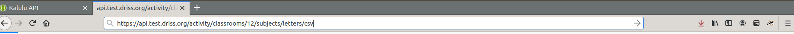

# API MANUAL 

>> this is a manual to 

## What is an API ?

API stands for Application Programming Interface.

It consists of a web interface between the user and the database: 
it exposes url (called **endpoint**) to access, update, delete, create the data inside the tables of the database called resources providing  HTTP **methods** using **parameters** in the url.

The API interface gives a facility for researcher and administrator to:
access, consult and edit the data stored in the database. API is then the main entrance to control the settings, results and statistics of the database and understand the data underlying feeding each plot and graphic in the web dashboard.

Endpoint consist of a dynamic url for a resource accessible throught ***methods*** corresponding to actions, and ***parameters*** acting  like filters. 

For better understanding, they are organized into ***categories***. 
One categorie gathers multiple endpoints for one type of resource.

> Current API interface is available at : 

> [https://research.ludoeducation.fr](https://research.ludoeducation.fr)

## Anatomy of the API

The API provides an web user-friendly interface using Swagger and Open API specifications for describing the schema. 
In this interface, ***categories*** consists of dropdown list with a short description of the kind of resource. 
When you click on it: the full list of ***endpoints*** available will appear.

### Category endpoint

All resources that describe the activity of students are stored in a **category endpoint**. 

Take a closer look at category called `activity`. 

Activity regroups statistics on game usage at student / classroom level consultable on global, on a specific subject or dataset.

This access is usefull for researcher and admin to consult **global activity** of a student or a classroom (timespent, session of gameplay, scores). 

> These endpoint offers different level of information to control activity data. 

Such endpoint will retrive data that can answer at different level to question such as:

* Is classroom respecting the order of sessions and the frequency?

* What is the average timespent on a subject?

* Is there a difference in timespent and good reponses depending of the order of the session? 

* Are student spending more time on chapter session or lesson session? 

<small>
Theses endpoint are also used to display information or feed the plot into the teacher dashboard :

> As an example: 
> Student info is displayed loading data from [API endpoint: 'activity/students/1226/subjects/letters/info'](https://api.test.driss.org/activity/students/1226/subjects/letters/info) 

</small>

)

If you click on the category section activity bar: a list of **endpoints** will appear for activity category with a short description. 

### What is an endpoint API?

API endpoint is an access point to a resource stored in the database. It consists technically of :

* an **URL**: giving the location of the resource (called URI: Unified Resources Identifier) composed of the path and the parameters into `{}`

* a **method**: expressed in an HTTP Verb which corresponds to a specific interaction with the database
    * GET 
    * PUT 
    * POST 
    * DELETE
Swagger interface added an explicit color code for each of these method.

With those 2 elements, we will perform an HTTP request explicitly describing
where is the resource and the interaction with it: simply using the HTTP protocol. 

#### Endpoint Sections:

If you click on one specific endpoint, 4 main sections appears: 

- the header endpoint 
- the documentation 
- the parameters section
- the response section

#### Header

The interface displays for each endpoint:

* the **method** GET in blue to view, PUT in orange to edit/update the resource, DELETE in red to remove the resource, CREATE in green to add a new ressource

* the **url** where the resource is accessible with the **parameters** that are always between `{}`

* a short **description** of the resources availables

* and eventually a **lock** button if the resource is protected throught password

#### Documentation

- Description : explains what kind of information is available
- Methods: give an SQL equivalent of the query made to the database
- Structure of the output (mostly for graphs)
- Link to database documentation

 

#### Parameters

Section parameters consists of displaying:

- the name of the different **parameters** availables  
- the different **input types** accepted: such as integer, string, coma separated values, string with controled values, ...

Theses parameters always corresponds to elements in brackets inside the url. theses parameters allows to create custom queries using parameters as fields and filters.

Example:

Endoint: `activity/students/{student}/subjects/{subject}/`
Query: `activity/students/1226/subjects/letters/info`

Loads activity information on student n° 1226 and on subject letters

> try to change the parameters to get other student on other subject

### Response section

Response section guides you over the responses giving first generic response
with code atteched to a textual description that explains the type of error.

Performing a request thought the interface make the response section change: giving more information on the process.

When everything went OK: data is displayed inside the response section with the corresponding 200 code.

When something went wrong a message is return giving contextual information. Depending on the type of error: the code is attached:

* 404 data was not found or resource is not available
* 406 one or multiple parameters were incorrect
* 500 error came from the database or the API (contact administrator in this case)

## How to get data from the API?

To access the data you have the differents options:

* [Try it online](###Try_it_online) with the web interface
* [Try it directly](###Direct_access) on your web browser
* [Load the CSV version](###CSV_format) of the data
* [Use external script](###External_script) to manipulate the data

### Try it online

##### Make the request

Press the button `tryit`

A new form will appear asking to fill out the parameters

Fill the box with the required parameters and press execute

Once executed API shows in the black box the request made

> The tryit online button and forms helps to build the url by filling out parameters
> Here requests url black box shows wich request have been made with the correct parameters: for classroom 1 and subject `letters` this only consisting of changing values between the {} in url. For endpoint `API_URL/activity/classrooms/{classroom}/subjects/{subject}` the replacement has been made as the following `API_URL/activity/classrooms/1/subjects/letters`

##### Understand the response

The result is displayed in the section server response:
- with a generic **code** and a description **message**
- detailled response lays into section `response body`

Detailled type of responses the server can give are listed below and described

###### Response is OK

If response is 200 or 204: no problem have been encountered: API response body displays the data from the database

##### Response is Wrong

Each error code (404, 406, 500) corresponds to a certain type of response: 
a generic error message is attached and detail of the error lays in message body

* If error is 404: no data has been found

* If error is 406: parameter given is incorrect. In this case response body message gives the wrong parameter

* If error is 500: table is empty. It means that population of database had a problem and need to be executed again ask for admin to regenerate the database

### Direct access 

You can also acess it directly into the web browser without loading the interface.

Online tryit button guided you to build the request URL through 
a web form and helped you to understand the response displaying extended documentation on messages, responses and errors types.

Blue endpoints (GET methods) can be directly accessible into your favorite web browser without filling the form inside the interface as it consists simply on loading a page.

#### Prepare your request

* In the interface copy the request URL

Change the parameters if you need it

* Paste it into the navigation bar of your favorite web browser

* Press enter

You have now access to the raw response inside your web browser!

##### Understand the response

Status code gives you the information on success/failure of the request

* 200 OK
* 404 Not found
* 406 Wrong parameters

### CSV format

###### Prepare the request
* In the API interface copy the request URL

* Paste it into the navigation bar of your favorite web browser

* Add `/csv` at the end of the url

* Press enter

You now have access to the data in a CSV format!

###### Understand the response

Status code inside the HTML page 
gives you the information on success/failure of the request:

* 200 OK => displays the table on the screen
* 404 Not found => No data
* 406 Wrong parameters => Your request has some problem in parameters

##### Advanced use

Ready for next level?

Consult the tutorial for [advanced use](advanced-use.md)
